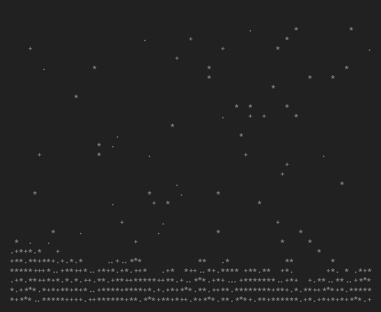
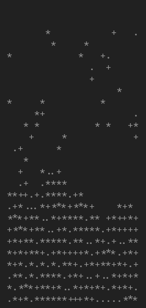

# snowfall
a little program that simulates snowfall in about 30 lines, right in your gnu/linux terminal !

# configuration
snowfall can be adjusted with 4 additional arguments when running

all are not required to run, but whichever ones are used must be in order

### arguments
 - world width (number of chars in x direction)
 - world height (number of chars in y direction)
 - snowflake spawn chance (chance per character in top row to spawn a snowflake per tick)
 - sleep duration (number of milliseconds in between ticks)

### defaults
 - width: 80
 - height: 30
 - spawn chance: 3
 - sleep: 300

### examples
| **small square** | **tall rectangle** |
| ---------------- | ------------------- |
| `./snowfall.o 30 15` | `./snowfall.o 25 25 10 100` |
|  |  |
